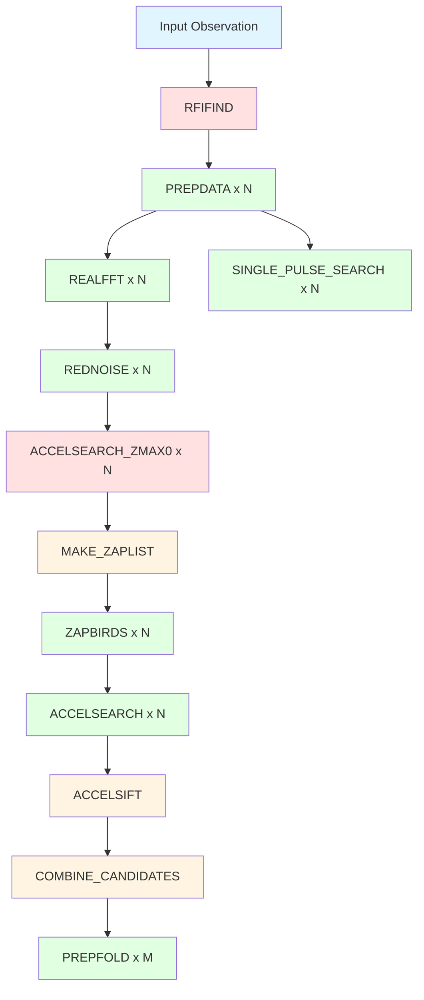

# NEXTO Architecture Documentation

## Pipeline Overview

NEXTO implements the PULSAR_MINER pipeline as a Directed Acyclic Graph (DAG) of Nextflow processes, enabling massive parallelization across cluster nodes.

## Workflow Structure

```
Input Observation (.fil/.fits)
    ↓
┌───────────────────────────────────────────────────────────────┐
│ Optional: Filterbank Processing                              │
│   FILTOOL → Time/freq decimation + RFI filtering (PulsarX)   │
└───────────────────────────────────────────────────────────────┘
    ↓
┌───────────────────────────────────────────────────────────────┐
│ Stage 1: RFI Detection                                        │
│   RFIFIND → Creates RFI mask                                  │
└───────────────────────────────────────────────────────────────┘
    ↓ (observation + mask)
    ↓
┌───────────────────────────────────────────────────────────────┐
│ Stage 2: Dedispersion (HIGHLY PARALLELIZED)                  │
│   PREPDATA × N (where N = number of DM trials)               │
│   Each DM trial runs independently on separate node          │
│   Example: 200 DMs → 200 parallel jobs                       │
└───────────────────────────────────────────────────────────────┘
    ↓ (timeseries × N)
    ↓
┌───────────────────────────────────────────────────────────────┐
│ Stage 3: Birdie Detection & Zaplist Creation                 │
│   ACCELSEARCH_ZMAX0 (once) → z=0 search to find RFI lines    │
│        ↓                                                       │
│   MAKE_ZAPLIST → Creates frequency mask from all detections  │
└───────────────────────────────────────────────────────────────┘
    ↓ (zaplist)
    ↓
┌───────────────────────────────────────────────────────────────┐
│ Stage 4: Acceleration Search (PARALLELIZED per DM)           │
│   ACCELSEARCH × N → Searches for accelerated signals         │
│   Uses zaplist to mask known RFI                             │
└───────────────────────────────────────────────────────────────┘
    ↓ (Candidates × N)
    ↓
┌───────────────────────────────────────────────────────────────┐
│ Stage 5: Candidate Sifting                                    │
│   ACCELSIFT → Filters by sigma, removes harmonics/duplicates │
│   COMBINE_SIFTED_CANDFILES → Merges all DM trials           │
└───────────────────────────────────────────────────────────────┘
    ↓ (Top candidates)
    ↓
┌───────────────────────────────────────────────────────────────┐
│ Stage 6: Candidate Folding (PARALLELIZED per candidate)      │
│   PREPFOLD_FROM_CANDFILE × M (PRESTO) OR                     │
│   PSRFOLD_PULSARX × M (PulsarX)                              │
│   Creates phase-folded profiles                              │
└───────────────────────────────────────────────────────────────┘
    ↓
┌───────────────────────────────────────────────────────────────┐
│ Optional: Single Pulse Search (PARALLELIZED per DM)          │
│   SINGLE_PULSE_SEARCH × N                                    │
└───────────────────────────────────────────────────────────────┘
    ↓
Final Results
```

## Parallelization Strategy

### Level 1: DM Trial Parallelization (Primary)

The most significant speedup comes from processing DM trials in parallel:

**Original PULSAR_MINER:**
```
for dm in dm_list:
    prepdata(dm)      # Sequential
    realfft(dm)
    accelsearch(dm)
Total time: N × time_per_dm
```

**NEXTO:**
```
All DM trials run simultaneously across cluster nodes
Total time: time_per_dm (with sufficient resources)
```

**Speedup Example:**
- 200 DM trials, 10 minutes per trial
- PULSAR_MINER: 200 × 10 = 2000 minutes (~33 hours)
- NEXTO with 200 nodes: ~10 minutes

### Level 2: Stage Parallelization

Within each stage, independent operations run in parallel:

```
Stage 3: FFT Processing
├── REALFFT(DM=0)    ─┐
├── REALFFT(DM=0.5)  ─┤
├── REALFFT(DM=1.0)  ─┤  All run
├── ...              ─┤  in parallel
└── REALFFT(DM=200)  ─┘
```

### Level 3: Candidate Folding

Top candidates are folded in parallel:

```
PREPFOLD(candidate_1) ─┐
PREPFOLD(candidate_2) ─┤ Parallel
PREPFOLD(candidate_3) ─┤ folding
...                   ─┘
```

## Process Dependency Graph



## Module Organization

### [modules.nf](modules.nf)

Contains all process definitions, organized by stage:

1. **Input Validation** (1 process)
   - `READFILE` - Extract observation metadata

2. **Filterbank Processing** (1 process, optional)
   - `FILTOOL` - Time/freq decimation and RFI filtering (PulsarX)

3. **RFI Detection** (1 process)
   - `RFIFIND` - Detect and mask RFI

4. **Dedispersion** (1 process)
   - `PREPDATA` - Create dedispersed timeseries

5. **Birdie Masking** (2 processes)
   - `ACCELSEARCH_ZMAX0` - Identify RFI lines (z=0 search)
   - `MAKE_ZAPLIST` - Create frequency mask

6. **Periodicity Search** (1 process)
   - `ACCELSEARCH` - Acceleration search with zaplist masking

7. **Candidate Sifting** (2 processes)
   - `ACCELSIFT` - Filter by sigma, remove harmonics/duplicates
   - `COMBINE_SIFTED_CANDFILES` - Merge all DM trials

8. **Folding** (3 processes)
   - `PREPFOLD_FROM_CANDFILE` - Fold from candidate file (PRESTO)
   - `PREPFOLD_TIMESERIES` - Fold from timeseries (PRESTO)
   - `PSRFOLD_PULSARX` - Fold with PulsarX backend

9. **Single Pulse** (1 process)
   - `SINGLE_PULSE_SEARCH` - Detect transients

10. **Utilities** (1 process)
    - `COMBINE_CANDIDATES` - Merge candidate lists

### [nexto_search.nf](nexto_search.nf)

Main workflow that:
1. Imports modules from `modules.nf`
2. Defines parameter defaults
3. Creates data channels
4. Connects processes via channels
5. Handles workflow lifecycle

### [nextflow.config](nextflow.config)

Configuration including:
1. Global parameters
2. Resource allocation (CPU, memory, time)
3. Execution profiles (local, SLURM, PBS, AWS, etc.)
4. PRESTO environment setup
5. Reporting and tracing

## Data Flow

### Channel Types

**Value Channels** - Single values passed to all processes
```groovy
zmax_ch = Channel.value(params.zmax)
```

**Queue Channels** - Streams of data consumed once
```groovy
observation_ch = Channel.fromPath(params.input)
```

**Tuple Channels** - Multiple related values
```groovy
[dm, fftfile, inffile]
```

### Example Data Flow

```groovy
// Initial observation
observation_ch = Channel.fromPath('obs.fil')
    → [obs.fil]

// After RFIFIND
RFIFIND.out.rfi_products
    → [obs.fil, [obs_rfifind.mask, obs_rfifind.stats, ...]]

// Create DM trials
.combine(Channel.from(0.0, 0.5, 1.0, ...))
    → [obs.fil, mask, 0.0]
    → [obs.fil, mask, 0.5]
    → [obs.fil, mask, 1.0]
    → ...

// After PREPDATA
PREPDATA.out.timeseries
    → [0.0, obs_DM0p00.dat, obs_DM0p00.inf]
    → [0.5, obs_DM0p50.dat, obs_DM0p50.inf]
    → ...
```

## Resource Management

### Explicit Process-Specific Allocation

NEXTO uses explicit resource allocation for each process. Resources are standardized across all HPC clusters:

| Process | CPUs | Memory | Time | maxForks | Use Case |
|---------|------|--------|------|----------|----------|
| FILTOOL | 16 | 8GB | 4h | 1 | Filterbank preprocessing |
| RFIFIND | 1 | 8GB | 4h | 400 | RFI detection |
| PREPDATA | 1 | 4GB | 4h | 400 | Dedispersion |
| ACCELSEARCH | 16 (1 if GPU) | 8GB | 2d | 200 | Acceleration search |
| ACCELSEARCH_ZMAX0 | 8 | 8GB | 4h | 200 | Birdie detection |
| PREPFOLD.* | 1 | 8GB | 4h | 400 | PRESTO folding |
| PSRFOLD_PULSARX | 16 | 8GB | 4h | 400 | PulsarX folding |
| SINGLE_PULSE_SEARCH | 4 | 8GB | 4h | 500 | Transient search |
| Lightweight tasks | 2 | 4GB | 1h | 500 | MAKE_ZAPLIST, ACCELSIFT, etc. |

### Dynamic Scaling

Resources scale automatically with retries using `check_max()`:
```groovy
memory = { check_max(8.GB * task.attempt, 'memory') }
time = { check_max(4.h * task.attempt, 'time') }
```

### Queue Selection (Cluster-Specific)

**Hercules** - Dynamic queue selection:
- `short.q` - Jobs ≤4h
- `long.q` - Jobs >4h
- `gpu.q` - GPU-enabled acceleration searches

**OzSTAR** - Uses default queue

**Contra** - Single queue (HT-Condor)

## Error Handling

### Retry Strategy

Failed tasks automatically retry with increased resources:
```groovy
errorStrategy = { task.attempt <= 3 ? 'retry' : 'finish' }
maxRetries = 3
```

Attempt 1: 16 GB, 4h
Attempt 2: 32 GB, 8h
Attempt 3: 64 GB, 16h

### Resume Capability

Nextflow tracks completed tasks via work directory hashing:
- Interrupted runs: `nextflow run -resume`
- Only incomplete/failed tasks re-execute
- Successful tasks reuse cached results

## Scalability Analysis

### Theoretical Speedup

For N DM trials with P parallel workers:

**Sequential (PULSAR_MINER):**
```
Time = N × t_per_dm
```

**Parallel (NEXTO):**
```
Time = (N / P) × t_per_dm + t_overhead
```

**Efficiency:**
```
Speedup = N × t_per_dm / ((N / P) × t_per_dm + t_overhead)
```

### Real-World Example

**Survey Parameters:**
- DM range: 0-500 pc/cm³, step 0.5 = 1000 trials
- Acceleration: zmax 200
- Time per DM: 15 minutes

**PULSAR_MINER (sequential):**
```
1000 DMs × 15 min = 15,000 min = 10.4 days
```

**NEXTO with 100 nodes:**
```
(1000 / 100) × 15 min = 150 min = 2.5 hours
Speedup: ~100x
```

## Cluster Configurations

### SLURM

```groovy
process.executor = 'slurm'
process.queue = 'normal'
process.clusterOptions = '--account=proj123'
executor.queueSize = 200
```

### PBS/Torque

```groovy
process.executor = 'pbs'
process.queue = 'batch'
process.clusterOptions = '-A proj123'
```

### Cloud (AWS Batch)

```groovy
process.executor = 'awsbatch'
process.queue = 'pulsar-queue'
process.container = 'nexto-presto:latest'
aws.region = 'us-east-1'
```

## Monitoring

### Real-Time Monitoring

```bash
# Watch Nextflow progress
nextflow run nexto_search.nf ... -with-trace -with-timeline

# Monitor cluster jobs
watch squeue -u $USER  # SLURM
watch qstat -u $USER   # PBS
```

### Reports

After completion, view:
- `report.html` - Resource usage per process
- `timeline.html` - Execution timeline
- `pipeline_trace.txt` - Detailed task log
- `pipeline_dag.svg` - Workflow visualization

## Best Practices

### 1. DM Trial Tuning

Balance DM resolution vs. compute cost:
```
High resolution: --dm_step 0.1 → More trials, longer runtime
Standard: --dm_step 0.5 → Good balance
Coarse: --dm_step 1.0 → Faster, may miss signals
```

### 2. Resource Optimization

Monitor first run, then tune:
```groovy
withName: 'ACCELSEARCH' {
    // If jobs fail with OOM
    memory = '64.GB'  // Increase

    // If jobs finish quickly
    cpus = 16  // Increase parallelism
}
```

### 3. Queue Management

Don't overwhelm scheduler:
```groovy
executor.queueSize = 100  // Max concurrent jobs
executor.submitRateLimit = '10 sec'  // Job submission rate
```

### 4. Checkpointing

For long searches, use `-resume` liberally:
```bash
# Run 1: Start search
nextflow run nexto_search.nf --input obs.fil

# Run 2: If interrupted, resume
nextflow run nexto_search.nf --input obs.fil -resume
```

## Comparison: PULSAR_MINER vs. NEXTO

| Aspect | PULSAR_MINER | NEXTO |
|--------|--------------|-------|
| **Execution Model** | Sequential with threading | Fully parallel DAG |
| **DM Parallelism** | Limited by threads | Unlimited (cluster-wide) |
| **Cluster Support** | Manual batch scripts | Native (10+ schedulers) |
| **Resume** | Checkpoint files | Automatic work/ hashing |
| **Resource Mgmt** | Static config | Dynamic per-process |
| **Monitoring** | Log files | HTML reports + timeline |
| **Scalability** | Single node | Multi-node to cloud |
| **GPU Support** | Manual CUDA config | Profile-based |
| **Fault Tolerance** | Manual restart | Auto-retry with scaling |
| **Cloud Ready** | No | Yes (AWS, GCP, Azure) |

## Future Enhancements

Potential improvements:

1. **Adaptive DM Trials** - Dynamically adjust DM steps based on signal detection
2. **Machine Learning Sifting** - Replace sigma threshold with ML classifier
3. **Real-Time Processing** - Stream processing for live observations
4. **Multi-Beam Support** - Parallel processing of multiple beams
5. **Distributed Storage** - Integration with S3, Google Cloud Storage
6. **Advanced Scheduling** - Cost-aware scheduling for cloud execution
